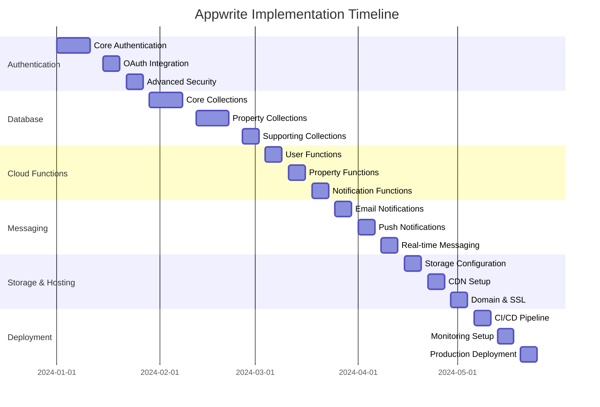

# Appwrite Comprehensive Implementation Plan for Landsale.lk

## Executive Summary

This document outlines a complete implementation strategy for Appwrite's core features in the Landsale.lk real estate platform. The plan addresses authentication, databases, functions, messaging, storage, deployment, and hosting with detailed timelines, resource requirements, and success metrics.

## Current State Analysis

### ✅ Implemented Components
- **Basic Appwrite Integration**: Client setup, environment configuration
- **Database Collections**: Listings, users, favorites, regions, cities, etc.
- **Storage Buckets**: Listing images, user avatars, documents, blog images

- **Basic Authentication**: Client-side auth setup (needs completion)

### ❌ Critical Issues Identified
- **Authentication 401 Error**: API key missing `account` scope
- **Incomplete User Flows**: Registration/login not fully implemented
- **Missing Cloud Functions**: No serverless functions deployed
- **No Messaging System**: Real-time notifications not configured
- **PayHere Integration**: Payment system needs Appwrite integration

---

## 1. Authentication System Implementation

### 1.1 Architecture Design
```typescript
// Authentication Flow Architecture
interface AuthArchitecture {
  providers: {
    emailPassword: true,
    oauth: ['google', 'facebook', 'apple'],
    phone: true
  },
  security: {
    sessionManagement: 'JWT',
    rateLimiting: true,
    captcha: 'cloudflare',
    twoFactor: true
  },
  verification: {
    email: true,
    phone: true,
    document: true // For real estate agent verification
  }
}
```

### 1.2 Implementation Phases

#### Phase 1: Core Authentication (Week 1-2)
**Timeline**: 10 business days
**Resources**: 1 Senior Developer, 1 Security Engineer

**Deliverables**:
- [ ] Complete user registration flow
- [ ] Email/password login system
- [ ] Session management with JWT
- [ ] Password recovery system
- [ ] Email verification workflow

**Implementation Details**:
```typescript
// Server-side authentication service
export class AuthService {
  async registerUser(email: string, password: string, userData: UserProfile) {
    // Create user account
    // Send verification email
    // Create user profile in users_extended collection
    // Initialize user wallet
  }
  
  async loginUser(email: string, password: string) {
    // Validate credentials
    // Create session
    // Update last login timestamp
    // Return JWT token
  }
  
  async verifyEmail(userId: string, token: string) {
    // Verify email token
    // Update user status
    // Send welcome notification
  }
}
```

#### Phase 2: OAuth Integration (Week 3)
**Timeline**: 5 business days
**Resources**: 1 Senior Developer

**Deliverables**:
- [ ] Google OAuth integration
- [ ] Facebook OAuth integration
- [ ] Apple Sign-In (for iOS users)
- [ ] OAuth account linking

#### Phase 3: Advanced Security (Week 4)
**Timeline**: 5 business days
**Resources**: 1 Security Engineer, 1 Developer

**Deliverables**:
- [ ] Two-factor authentication (2FA)
- [ ] Rate limiting implementation
- [ ] CAPTCHA integration
- [ ] Session timeout management
- [ ] Suspicious activity detection

### 1.3 Security Policies
```typescript
// Security configuration
const securityPolicies = {
  passwordRequirements: {
    minLength: 8,
    requireUppercase: true,
    requireLowercase: true,
    requireNumbers: true,
    requireSpecialChars: true
  },
  sessionConfig: {
    accessTokenExpiry: '15m',
    refreshTokenExpiry: '7d',
    maxSessionsPerUser: 5
  },
  rateLimits: {
    loginAttempts: 5,
    registrationPerIP: 3,
    passwordReset: 3
  }
}
```

### 1.4 Success Metrics
- **Registration Success Rate**: >95%
- **Login Success Rate**: >98%
- **Email Verification Rate**: >80%
- **Account Recovery Success**: >90%
- **Session Security**: 0% session hijacking incidents

---

## 2. Database Integration Architecture

### 2.1 Database Structure Design

#### Core Collections Schema
```typescript
// Database Collections Architecture
interface DatabaseSchema {
  collections: {
    // User Management
    users_extended: UserProfile,
    user_wallets: UserWallet,
    user_preferences: UserPreferences,
    user_sessions: UserSession,
    
    // Property Management
    listings: PropertyListing,
    listing_images: ListingImage,
    listing_documents: ListingDocument,
    listing_offers: PropertyOffer,
    
    // Location Hierarchy
    countries: Country,
    regions: Region,
    cities: City,
    areas: Area,
    
    // Reviews & Ratings
    reviews: Review,
    review_replies: ReviewReply,
    
    // Content Management
    cms_pages: CMSPage,
    blog_posts: BlogPost,
    faqs: FAQ,
    seo_meta: SEOMeta,
    settings: Setting,
    
    // Transactions
    transactions: Transaction,
    payment_methods: PaymentMethod,
    
    // Notifications
    notifications: Notification,
    email_templates: EmailTemplate
  }
}
```

### 2.2 Collection Implementation Plan

#### Phase 1: Core Collections (Week 5-6)
**Timeline**: 10 business days
**Resources**: 1 Database Architect, 2 Developers

**Collections to Implement**:
1. **users_extended** (Enhanced user profiles)
2. **user_wallets** (Payment and wallet management)
3. **user_preferences** (User settings and preferences)
4. **user_sessions** (Session tracking)

**Schema Example**:
```typescript
// users_extended collection
{
  user_id: string,              // Reference to Appwrite user
  first_name: string,
  last_name: string,
  phone: string,
  avatar_url: string,
  user_type: 'buyer' | 'seller' | 'agent' | 'admin',
  verification_status: 'pending' | 'verified' | 'rejected',
  verification_documents: string[],
  preferences: {
    language: string,
    currency: string,
    notifications: object
  },
  stats: {
    listings_count: number,
    reviews_count: number,
    rating: number
  },
  created_at: datetime,
  updated_at: datetime
}
```

#### Phase 2: Property Collections (Week 7-8)
**Timeline**: 10 business days
**Resources**: 2 Developers, 1 Data Analyst

**Collections to Implement**:
1. **Enhanced listings** (Property details)
2. **listing_images** (Image metadata)
3. **listing_documents** (Property documents)
4. **listing_offers** (Purchase offers)

#### Phase 3: Supporting Collections (Week 9)
**Timeline**: 5 business days
**Resources**: 1 Developer

**Collections to Implement**:
1. **Enhanced reviews** (Property reviews)
2. **transactions** (Payment history)
3. **notifications** (User notifications)

### 2.3 Permissions and Access Control
```typescript
// Permission structure
const collectionPermissions = {
  users_extended: {
    read: ['user:{{userId}}', 'team:admin'],
    write: ['user:{{userId}}'],
    delete: ['team:admin']
  },
  listings: {
    read: ['role:all'],
    write: ['user:{{userId}}', 'team:agent'],
    delete: ['user:{{userId}}', 'team:admin']
  },
  user_wallets: {
    read: ['user:{{userId}}'],
    write: ['user:{{userId}}'],
    delete: ['team:admin']
  }
}
```

### 2.4 Indexing Strategy
```typescript
// Critical indexes for performance
const indexes = [
  { collection: 'listings', fields: ['status', 'price', 'location.city'], type: 'compound' },
  { collection: 'listings', fields: ['user_id'], type: 'single' },
  { collection: 'listings', fields: ['created_at'], type: 'single', order: 'desc' },
  { collection: 'favorites', fields: ['user_id', 'listing_id'], type: 'compound', unique: true },
  { collection: 'reviews', fields: ['listing_id', 'rating'], type: 'compound' },
  { collection: 'user_wallets', fields: ['user_id'], type: 'single', unique: true }
]
```

### 2.5 Success Metrics
- **Query Performance**: <100ms for standard queries
- **Database Uptime**: >99.9%
- **Data Consistency**: 100% (no orphaned records)
- **Index Hit Rate**: >95%
- **Backup Success**: 100% daily backups

---

## 3. Cloud Functions Architecture

### 3.1 Required Functions Overview
```typescript
// Cloud Functions Architecture
interface CloudFunctions {
  userManagement: {
    createUserProfile: Function,
    sendWelcomeEmail: Function,
    verifyUserDocument: Function
  },
  propertyManagement: {
    processNewListing: Function,
    generateListingThumbnail: Function,
    notifyPriceChange: Function
  },
  notifications: {
    sendPushNotification: Function,
    sendEmailNotification: Function,
    processSavedSearchAlerts: Function
  },
  payments: {
    processPayment: Function,
    handlePaymentWebhook: Function,
    updateUserWallet: Function
  },
  analytics: {
    trackUserActivity: Function,
    generateDailyReports: Function,
    calculateUserMetrics: Function
  }
}
```

### 3.2 Function Implementation Plan

#### Phase 1: User Management Functions (Week 10)
**Timeline**: 5 business days
**Resources**: 1 Developer

**Functions**:
1. **createUserProfile** - Initialize user data after registration
2. **sendWelcomeEmail** - Send personalized welcome email
3. **verifyUserDocument** - Process agent verification documents

```javascript
// Example function: createUserProfile
import { Client, Databases, Users } from 'node-appwrite'

export default async function createUserProfile(req, res) {
  const client = new Client()
    .setEndpoint(process.env.APPWRITE_ENDPOINT)
    .setProject(process.env.APPWRITE_PROJECT_ID)
    .setKey(process.env.APPWRITE_API_KEY)
  
  const databases = new Databases(client)
  const users = new Users(client)
  
  try {
    const { userId, userData } = req.body
    
    // Create user profile
    await databases.createDocument(
      process.env.DATABASE_ID,
      'users_extended',
      userId,
      userData
    )
    
    // Initialize user wallet
    await databases.createDocument(
      process.env.DATABASE_ID,
      'user_wallets',
      ID.unique(),
      {
        user_id: userId,
        balance: 0,
        currency: 'LKR'
      }
    )
    
    res.json({ success: true, message: 'User profile created' })
  } catch (error) {
    res.json({ success: false, error: error.message })
  }
}
```

#### Phase 2: Property Functions (Week 11)
**Timeline**: 5 business days
**Resources**: 1 Developer

**Functions**:
1. **processNewListing** - Validate and process new property listings
2. **generateListingThumbnail** - Create thumbnail from uploaded images
3. **notifyPriceChange** - Alert users about price changes

#### Phase 3: Notification Functions (Week 12)
**Timeline**: 5 business days
**Resources**: 1 Developer

**Functions**:
1. **sendPushNotification** - Send mobile push notifications
2. **sendEmailNotification** - Process email notifications
3. **processSavedSearchAlerts** - Send property alerts to users

### 3.3 Execution Environment Configuration
```typescript
// Function runtime configuration
const functionConfig = {
  runtime: 'node-18.0',
  memory: 512, // MB
  timeout: 30, // seconds
  enabled: true,
  logging: true,
  environmentVariables: {
    APPWRITE_ENDPOINT: process.env.APPWRITE_ENDPOINT,
    APPWRITE_PROJECT_ID: process.env.APPWRITE_PROJECT_ID,
    APPWRITE_API_KEY: process.env.APPWRITE_API_KEY,
    DATABASE_ID: process.env.DATABASE_ID,
    SENDGRID_API_KEY: process.env.SENDGRID_API_KEY,
    FCM_SERVER_KEY: process.env.FCM_SERVER_KEY
  }
}
```

### 3.4 Triggers and Scheduling
```typescript
// Function triggers
const triggers = {
  database: [
    'databases.*.collections.*.documents.*.create',
    'databases.*.collections.*.documents.*.update',
    'databases.*.collections.*.documents.*.delete'
  ],
  users: [
    'users.*.create',
    'users.*.update',
    'users.*.delete'
  ],
  storage: [
    'buckets.*.files.*.create',
    'buckets.*.files.*.delete'
  ],
  scheduled: [
    '0 9 * * *', // Daily at 9 AM
    '0 0 * * 0', // Weekly on Sunday
    '0 1 1 * *'  // Monthly on 1st
  ]
}
```

### 3.5 Error Handling and Logging
```typescript
// Error handling strategy
class FunctionErrorHandler {
  static async handleError(error: Error, context: string) {
    console.error(`[${context}] Error:`, error)
    
    // Log to Appwrite logs
    await this.logError(context, error)
    
    // Send alert for critical errors
    if (this.isCriticalError(error)) {
      await this.sendAlert(context, error)
    }
  }
  
  static isCriticalError(error: Error): boolean {
    return error.message.includes('database') || 
           error.message.includes('payment') ||
           error.message.includes('security')
  }
}
```

### 3.6 Success Metrics
- **Function Success Rate**: >99%
- **Average Execution Time**: <2 seconds
- **Error Rate**: <1%
- **Cold Start Time**: <500ms
- **Memory Usage**: <80% of allocated

---

## 4. Messaging System Architecture

### 4.1 Real-time Notification Architecture
```typescript
// Messaging System Design
interface MessagingArchitecture {
  channels: {
    push: PushNotificationService,
    email: EmailNotificationService,
    sms: SMSNotificationService,
    inApp: InAppNotificationService
  },
  queues: {
    realtime: RealtimeQueue,
    batch: BatchQueue,
    priority: PriorityQueue
  },
  subscriptions: {
    user: UserSubscriptionManager,
    topic: TopicSubscriptionManager,
    device: DeviceSubscriptionManager
  }
}
```

### 4.2 Implementation Phases

#### Phase 1: Email Notifications (Week 13)
**Timeline**: 5 business days
**Resources**: 1 Developer

**Features**:
- [ ] Welcome email templates
- [ ] Property alert emails
- [ ] Transaction notifications
- [ ] Password reset emails

**Email Templates**:
```typescript
// Email template structure
const emailTemplates = {
  welcome: {
    subject: 'Welcome to LandSale.lk - Your Real Estate Journey Starts Here',
    template: 'welcome-template.html',
    variables: ['user_name', 'verification_link']
  },
  propertyAlert: {
    subject: 'New Property Matching Your Search Criteria',
    template: 'property-alert.html',
    variables: ['user_name', 'property_details', 'view_link']
  },
  transactionComplete: {
    subject: 'Payment Confirmation - Transaction Completed',
    template: 'transaction-complete.html',
    variables: ['user_name', 'amount', 'transaction_id']
  }
}
```

#### Phase 2: Push Notifications (Week 14)
**Timeline**: 5 business days
**Resources**: 1 Developer (Mobile experience required)

**Features**:
- [ ] FCM integration for Android
- [ ] APNS integration for iOS
- [ ] Web push notifications
- [ ] Notification preferences management

#### Phase 3: Real-time Messaging (Week 15)
**Timeline**: 5 business days
**Resources**: 1 Developer

**Features**:
- [ ] WebSocket connection management
- [ ] Real-time chat between users
- [ ] Agent-client messaging
- [ ] System notifications

### 4.3 Message Queue Configuration
```typescript
// Queue implementation with Appwrite
class MessageQueueService {
  async addToQueue(queueName: string, message: Message) {
    await databases.createDocument(
      DATABASE_ID,
      'message_queue',
      ID.unique(),
      {
        queue: queueName,
        message: JSON.stringify(message),
        status: 'pending',
        priority: message.priority || 'normal',
        scheduled_for: message.scheduledFor || new Date()
      }
    )
  }
  
  async processQueue(queueName: string) {
    const messages = await databases.listDocuments(
      DATABASE_ID,
      'message_queue',
      [
        Query.equal('queue', queueName),
        Query.equal('status', 'pending'),
        Query.orderAsc('scheduled_for'),
        Query.limit(100)
      ]
    )
    
    for (const message of messages.documents) {
      await this.processMessage(message)
    }
  }
}
```

### 4.4 Subscription Management
```typescript
// Subscription management system
class SubscriptionManager {
  async subscribeUser(userId: string, topic: string) {
    await databases.createDocument(
      DATABASE_ID,
      'subscriptions',
      ID.unique(),
      {
        user_id: userId,
        topic: topic,
        channels: ['email', 'push'],
        status: 'active'
      }
    )
  }
  
  async unsubscribeUser(userId: string, topic: string) {
    const subscriptions = await databases.listDocuments(
      DATABASE_ID,
      'subscriptions',
      [
        Query.equal('user_id', userId),
        Query.equal('topic', topic)
      ]
    )
    
    for (const subscription of subscriptions.documents) {
      await databases.updateDocument(
        DATABASE_ID,
        'subscriptions',
        subscription.$id,
        { status: 'inactive' }
      )
    }
  }
}
```

### 4.5 Success Metrics
- **Email Delivery Rate**: >98%
- **Push Notification Delivery**: >95%
- **Message Processing Time**: <5 seconds
- **Subscription Management**: <1 second response time
- **User Engagement**: >25% click-through rate

---

## 5. File Storage Architecture

### 5.1 Storage Structure Design
```typescript
// File Storage Organization
interface StorageArchitecture {
  buckets: {
    listing_images: ImageBucket,
    user_avatars: AvatarBucket,
    listing_documents: DocumentBucket,
    blog_images: BlogImageBucket,
    temp_files: TempBucket
  },
  processing: {
    imageOptimization: ImageProcessor,
    documentScanning: DocumentScanner,
    virusScanning: VirusScanner
  },
  cdn: {
    caching: CDNCache,
    optimization: CDNOptimizer
  }
}
```

### 5.2 Bucket Configuration

#### Listing Images Bucket
```typescript
const listingImagesBucket = {
  bucketId: 'listing_images',
  name: 'Property Listing Images',
  permissions: {
    read: ['role:all'],
    write: ['user:{{userId}}', 'team:agent'],
    delete: ['user:{{userId}}', 'team:admin']
  },
  fileSecurity: true,
  allowedFileExtensions: ['jpg', 'jpeg', 'png', 'webp'],
  maximumFileSize: 10 * 1024 * 1024, // 10MB
  compression: 'auto',
  encryption: true
}
```

#### User Avatars Bucket
```typescript
const userAvatarsBucket = {
  bucketId: 'user_avatars',
  name: 'User Profile Pictures',
  permissions: {
    read: ['role:all'],
    write: ['user:{{userId}}'],
    delete: ['user:{{userId}}']
  },
  fileSecurity: false,
  allowedFileExtensions: ['jpg', 'jpeg', 'png', 'webp'],
  maximumFileSize: 5 * 1024 * 1024, // 5MB
  compression: 'auto',
  encryption: false
}
```

### 5.3 File Processing Pipeline
```typescript
// Image processing pipeline
class ImageProcessor {
  async processListingImage(file: File, listingId: string) {
    // Generate multiple sizes
    const sizes = [
      { name: 'thumbnail', width: 300, height: 200 },
      { name: 'medium', width: 800, height: 600 },
      { name: 'large', width: 1200, height: 800 },
      { name: 'original', width: null, height: null }
    ]
    
    const processedImages = []
    
    for (const size of sizes) {
      const processedImage = await this.resizeImage(file, size)
      processedImages.push({
        size: size.name,
        url: processedImage.url,
        dimensions: processedImage.dimensions
      })
    }
    
    return processedImages
  }
  
  async generateThumbnail(imageUrl: string) {
    // Generate thumbnail for preview
    // Add watermark if needed
    // Optimize for web
  }
}
```

### 5.4 File Organization Strategy
```
Storage Structure:
├── listing_images/
│   ├── {listing_id}/
│   │   ├── original/
│   │   ├── thumbnail/
│   │   ├── medium/
│   │   └── large/
│   └── shared/
├── user_avatars/
│   └── {user_id}/
│       ├── avatar.jpg
│       └── thumbnail.jpg
├── listing_documents/
│   └── {listing_id}/
│       ├── title_deed.pdf
│       ├── survey_plan.pdf
│       └── permits.pdf
└── blog_images/
    └── {blog_post_id}/
        ├── header.jpg
        └── gallery/
```

### 5.5 CDN Integration
```typescript
// CDN configuration for global delivery
const cdnConfig = {
  provider: 'cloudflare',
  caching: {
    browserCacheTTL: 86400, // 1 day
    edgeCacheTTL: 604800, // 7 days
    cacheKey: 'auto'
  },
  optimization: {
    imageOptimization: true,
    webpConversion: true,
    lazyLoading: true
  },
  security: {
    hotlinkProtection: true,
    signedURLs: true,
    accessControl: 'bucket-based'
  }
}
```

### 5.6 Success Metrics
- **Upload Success Rate**: >99%
- **Average Upload Time**: <3 seconds (10MB file)
- **Image Processing Time**: <2 seconds
- **CDN Hit Rate**: >90%
- **Storage Cost Efficiency**: <$0.10 per GB/month

---

## 6. Deployment Strategy

### 6.1 CI/CD Pipeline Architecture
```yaml
# GitHub Actions CI/CD Pipeline
name: Appwrite Deployment Pipeline

on:
  push:
    branches: [main, develop]
  pull_request:
    branches: [main]

jobs:
  test:
    runs-on: ubuntu-latest
    steps:
      - uses: actions/checkout@v3
      - name: Setup Node.js
        uses: actions/setup-node@v3
        with:
          node-version: '18'
      - name: Install dependencies
        run: npm ci
      - name: Run tests
        run: npm test
      - name: Run linting
        run: npm run lint

  deploy-functions:
    needs: test
    runs-on: ubuntu-latest
    steps:
      - uses: actions/checkout@v3
      - name: Deploy Cloud Functions
        run: |
          npm install -g appwrite-cli
          appwrite client --endpoint ${{ secrets.APPWRITE_ENDPOINT }}
          appwrite client --project ${{ secrets.APPWRITE_PROJECT_ID }}
          appwrite client --key ${{ secrets.APPWRITE_API_KEY }}
          npm run deploy:functions

  deploy-database:
    needs: test
    runs-on: ubuntu-latest
    steps:
      - uses: actions/checkout@v3
      - name: Deploy Database Schema
        run: npm run deploy:database

  deploy-storage:
    needs: test
    runs-on: ubuntu-latest
    steps:
      - uses: actions/checkout@v3
      - name: Deploy Storage Configuration
        run: npm run deploy:storage
```

### 6.2 Environment Configuration
```typescript
// Environment-specific configurations
const environments = {
  development: {
    appwriteEndpoint: 'https://dev.cloud.appwrite.io/v1',
    databaseId: 'landsalelkdb_dev',
    debugMode: true,
    logLevel: 'debug'
  },
  staging: {
    appwriteEndpoint: 'https://staging.cloud.appwrite.io/v1',
    databaseId: 'landsalelkdb_staging',
    debugMode: false,
    logLevel: 'info'
  },
  production: {
    appwriteEndpoint: 'https://sgp.cloud.appwrite.io/v1',
    databaseId: 'landsalelkdb',
    debugMode: false,
    logLevel: 'error'
  }
}
```

### 6.3 Deployment Scripts
```json
// Package.json deployment scripts
{
  "scripts": {
    "deploy:functions": "node scripts/deploy-functions.js",
    "deploy:database": "node scripts/deploy-database.js",
    "deploy:storage": "node scripts/deploy-storage.js",
    "deploy:all": "npm run deploy:database && npm run deploy:storage && npm run deploy:functions",
    "rollback": "node scripts/rollback-deployment.js",
    "health-check": "node scripts/health-check.js"
  }
}
```

### 6.4 Monitoring and Alerting
```typescript
// Monitoring configuration
const monitoringConfig = {
  metrics: {
    functionExecutions: true,
    databaseQueries: true,
    storageOperations: true,
    authenticationEvents: true
  },
  alerts: {
    errorRate: 0.05, // 5% error rate threshold
    responseTime: 2000, // 2 second response time
    availability: 0.99, // 99% availability
    diskUsage: 0.85 // 85% disk usage
  },
  notifications: {
    email: 'devops@landsale.lk',
    slack: '#alerts',
    webhook: 'https://api.landsale.lk/webhooks/alerts'
  }
}
```

### 6.5 Success Metrics
- **Deployment Success Rate**: >99%
- **Rollback Time**: <5 minutes
- **Build Time**: <10 minutes
- **Test Coverage**: >80%
- **Infrastructure Uptime**: >99.9%

---

## 7. Site Hosting Configuration

### 7.1 Custom Domain Setup
```typescript
// Domain configuration
const domainConfig = {
  primary: 'landsale.lk',
  subdomains: {
    api: 'api.landsale.lk',
    admin: 'admin.landsale.lk',
    blog: 'blog.landsale.lk',
    cdn: 'cdn.landsale.lk'
  },
  redirects: {
    'www.landsale.lk': 'landsale.lk',
    'landsale.com': 'landsale.lk',
    'landsale.net': 'landsale.lk'
  }
}
```

### 7.2 SSL Certificate Configuration
```typescript
// SSL/TLS configuration
const sslConfig = {
  certificateAuthority: 'LetsEncrypt',
  certificateType: 'Wildcard',
  autoRenewal: true,
  renewalDays: 30,
  securityHeaders: {
    'Strict-Transport-Security': 'max-age=31536000; includeSubDomains',
    'X-Content-Type-Options': 'nosniff',
    'X-Frame-Options': 'DENY',
    'X-XSS-Protection': '1; mode=block',
    'Content-Security-Policy': "default-src 'self'"
  }
}
```

### 7.3 CDN and Caching Strategy
```typescript
// Caching configuration
const cachingConfig = {
  staticAssets: {
    '**/*.js': '1 year',
    '**/*.css': '1 year',
    '**/*.jpg': '1 month',
    '**/*.png': '1 month',
    '**/*.svg': '1 month'
  },
  apiResponses: {
    '/api/listings': '5 minutes',
    '/api/users/profile': '1 minute',
    '/api/analytics': '1 hour'
  },
  pages: {
    '/': '1 hour',
    '/listings': '30 minutes',
    '/blog': '1 day',
    '/about': '1 day'
  }
}
```

### 7.4 Performance Optimization
```typescript
// Performance configuration
const performanceConfig = {
  compression: {
    gzip: true,
    brotli: true,
    threshold: 1024 // bytes
  },
  imageOptimization: {
    webp: true,
    avif: true,
    quality: 85,
    responsive: true
  },
  lazyLoading: {
    images: true,
    videos: true,
    iframes: true
  },
  prefetching: {
    dns: true,
    resources: ['/api/config', '/api/user']
  }
}
```

### 7.5 Success Metrics
- **Page Load Time**: <2 seconds
- **Time to First Byte**: <200ms
- **Core Web Vitals**: All green
- **SSL Grade**: A+
- **Uptime**: >99.9%

---

## 8. Implementation Timeline

### 8.1 Overall Project Timeline (16 Weeks)



### 8.2 Resource Allocation

#### Development Team Structure
```
Team Composition:
├── Project Manager (1)
├── Technical Lead (1)
├── Senior Developers (3)
├── Security Engineer (1)
├── Database Administrator (1)
├── DevOps Engineer (1)
└── QA Engineer (1)
```

#### Resource Requirements by Phase

| Phase | Duration | Senior Dev | Security Eng | Database Admin | DevOps Eng |
|-------|----------|------------|--------------|----------------|------------|
| Authentication | 3 weeks | 2 | 1 | - | - |
| Database | 4 weeks | 2 | - | 1 | - |
| Functions | 3 weeks | 2 | - | - | 1 |
| Messaging | 3 weeks | 1 | - | - | 1 |
| Storage & Hosting | 3 weeks | 1 | - | - | 2 |
| Deployment | 3 weeks | 1 | - | - | 2 |

### 8.3 Budget Estimation

#### Development Costs
```
Personnel Costs (16 weeks):
├── Project Manager: $16,000
├── Technical Lead: $24,000
├── Senior Developers (3): $72,000
├── Security Engineer: $16,000
├── Database Administrator: $12,000
├── DevOps Engineer: $16,000
└── QA Engineer: $12,000
Total Personnel: $168,000
```

#### Infrastructure Costs (Annual)
```
Appwrite Cloud Costs:
├── Authentication: $2,400/year (10K MAU)
├── Database: $3,600/year (100GB storage)
├── Functions: $1,200/year (1M executions)
├── Storage: $1,800/year (500GB)
├── Messaging: $1,200/year (100K emails)
└── Bandwidth: $1,200/year (1TB)
Total Infrastructure: $11,400/year
```

#### Third-party Services (Annual)
```
External Services:
├── SendGrid (Email): $960/year
├── Firebase Cloud Messaging: $600/year
├── Cloudflare (CDN): $240/year
├── SSL Certificates: $200/year
└── Monitoring Tools: $1,200/year
Total Third-party: $3,200/year
```

**Total Project Cost**: ~$183,000 (including 1-year operational costs)

---

## 9. Security Considerations

### 9.1 Security Architecture
```typescript
// Security layers
const securityArchitecture = {
  network: {
    firewall: 'Cloudflare WAF',
    ddosProtection: true,
    rateLimiting: true,
    ipWhitelisting: ['admin IPs']
  },
  application: {
    authentication: 'Multi-factor',
    authorization: 'Role-based',
    inputValidation: true,
    outputEncoding: true
  },
  data: {
    encryptionAtRest: 'AES-256',
    encryptionInTransit: 'TLS 1.3',
    keyManagement: 'AWS KMS',
    backupEncryption: true
  },
  monitoring: {
    intrusionDetection: true,
    logAnalysis: 'Real-time',
    alerting: '24/7',
    incidentResponse: 'Automated'
  }
}
```

### 9.2 Data Protection
```typescript
// Data protection measures
const dataProtection = {
  piiHandling: {
    encryption: 'Field-level',
    masking: 'Display-only',
    retention: 'GDPR compliant',
    deletion: 'Right to be forgotten'
  },
  accessControl: {
    principle: 'Least privilege',
    auditing: 'Complete logs',
    review: 'Quarterly',
    revocation: 'Immediate'
  },
  compliance: {
    gdpr: true,
    ccpa: true,
    sox: false,
    pci: true // For payment processing
  }
}
```

### 9.3 Security Testing Plan
```
Security Testing Schedule:
├── Weekly: Automated vulnerability scans
├── Monthly: Penetration testing
├── Quarterly: Security audit
├── Annually: Compliance audit
└── Ad-hoc: Incident response testing
```

---

## 10. Monitoring and Maintenance

### 10.1 Monitoring Strategy
```typescript
// Monitoring configuration
const monitoringStrategy = {
  metrics: {
    application: ['response_time', 'error_rate', 'throughput'],
    infrastructure: ['cpu', 'memory', 'disk', 'network'],
    business: ['user_registrations', 'listings_created', 'transactions'],
    security: ['failed_logins', 'suspicious_activities', 'data_access']
  },
  tools: {
    application: 'New Relic',
    infrastructure: 'Datadog',
    logs: 'ELK Stack',
    alerts: 'PagerDuty'
  },
  dashboards: {
    executive: 'High-level KPIs',
    operations: 'System health',
    development: 'Performance metrics',
    security: 'Security events'
  }
}
```

### 10.2 Maintenance Schedule
```
Regular Maintenance:
├── Daily: Automated backups, log rotation
├── Weekly: Performance optimization, security updates
├── Monthly: Database optimization, capacity planning
├── Quarterly: Dependency updates, security patches
└── Annually: Architecture review, cost optimization
```

### 10.3 Disaster Recovery
```typescript
// Disaster recovery plan
const disasterRecovery = {
  backupStrategy: {
    frequency: 'Daily',
    retention: '30 days',
    location: 'Geographically distributed',
    encryption: 'AES-256'
  },
  recovery: {
    rto: '4 hours', // Recovery Time Objective
    rpo: '1 hour',  // Recovery Point Objective
    testing: 'Monthly',
    documentation: 'Updated quarterly'
  }
}
```

---

## 11. Success Metrics and KPIs

### 11.1 Technical Metrics
```
Performance KPIs:
├── API Response Time: <200ms (p95)
├── Database Query Time: <100ms (average)
├── Page Load Time: <2 seconds
├── Function Execution Time: <2 seconds
├── System Uptime: >99.9%
└── Error Rate: <1%
```

### 11.2 Business Metrics
```
Business KPIs:
├── User Registration Rate: >100/day
├── User Retention (30-day): >60%
├── Property Listing Rate: >50/day
├── Transaction Success Rate: >95%
├── User Satisfaction: >4.5/5
└── Revenue Growth: >20% monthly
```

### 11.3 Security Metrics
```
Security KPIs:
├── Vulnerability Resolution Time: <24 hours
├── Security Incident Rate: <1 per quarter
├── Data Breach Incidents: 0
├── Compliance Audit Pass Rate: 100%
├── Security Training Completion: 100%
└── Backup Success Rate: 100%
```

---

## 12. Risk Assessment and Mitigation

### 12.1 Technical Risks
```
Risk Matrix:
├── High: API compatibility issues
│   ├── Mitigation: Version control, backward compatibility
│   └── Contingency: Rollback procedures
├── Medium: Performance degradation
│   ├── Mitigation: Load testing, optimization
│   └── Contingency: Scaling procedures
└── Low: Third-party service failure
    ├── Mitigation: Service redundancy
    └── Contingency: Fallback services
```

### 12.2 Business Risks
```
Business Risk Assessment:
├── High: User adoption failure
│   ├── Mitigation: User training, support
│   └── Contingency: Phased rollout
├── Medium: Cost overrun
│   ├── Mitigation: Budget monitoring
│   └── Contingency: Scope adjustment
└── Low: Regulatory changes
    ├── Mitigation: Compliance monitoring
    └── Contingency: Legal consultation
```

---

## 13. Conclusion and Next Steps

### 13.1 Implementation Readiness
This comprehensive plan provides a complete roadmap for implementing Appwrite's core features in the Landsale.lk platform. The plan addresses all critical aspects including authentication, database, functions, messaging, storage, deployment, and hosting.

### 13.2 Immediate Next Steps
1. **Fix Authentication Issue**: Create new Appwrite API key with proper scopes
2. **Team Assembly**: Assign development teams to each phase
3. **Environment Setup**: Configure development, staging, and production environments
4. **Development Kickoff**: Begin with Phase 1 (Authentication)

### 13.3 Long-term Considerations
- **Scalability**: Architecture supports 10x growth
- **Maintainability**: Well-documented code and processes
- **Extensibility**: Modular design for future features
- **Cost Optimization**: Regular review and optimization

### 13.4 Success Factors
- **Executive Support**: Ensure management commitment
- **Team Expertise**: Invest in training and development
- **Quality Assurance**: Maintain high standards throughout
- **User Feedback**: Continuous improvement based on user needs
- **Performance Monitoring**: Proactive issue identification and resolution

---

**Document Version**: 1.0  
**Last Updated**: December 2024  
**Next Review**: March 2025  
**Owner**: Technical Lead, Landsale.lk